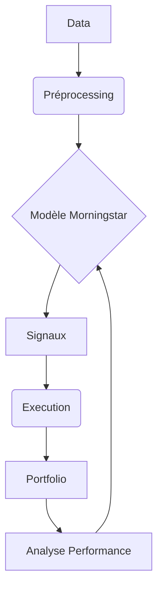

# Guide d'Utilisation - Morningstar Trading System

## 1. Configuration Initiale
### Prérequis
- Python 3.8+
- Conda/Miniconda
- Jupyter Notebook

### Installation
```bash
conda create -n trading_env python=3.8
conda activate trading_env
pip install -e .
```

## 2. Workflow Complet

### Entraînement du Modèle
1. Modifier les paramètres dans `Morningstar/configs/morningstar_config.py`
2. Exécuter le notebook d'entraînement :
```bash
jupyter notebook Morningstar/notebooks/Morningstar_Training.ipynb
```

### Backtest
1. Charger les données historiques dans `data/`
2. Lancer le notebook de backtest :
```bash
jupyter notebook Morningstar/notebooks/Morningstar_Backtest.ipynb
```

### Trading Live
```bash
python Morningstar/scripts/run_morningstar.py --trade
```

## 3. Gestion du Capital
Le système ajuste dynamiquement :
- La taille des positions selon la performance
- Le niveau de risque en fonction du drawdown
- La stratégie selon le timeframe

## 4. Monitoring
Consulter les logs :
- `logs/error.log` : Erreurs techniques
- `logs/trading.log` : Activité de trading

## 5. Architecture Technique


## 6. Personnalisation
Modifier :
- `morningstar_config.py` : Paramètres trading
- `morningstar_model.py` : Architecture du modèle
- `trading_workflow.py` : Stratégie d'exécution

## 7. Partage et Versionnement avec Hugging Face Hub

Hugging Face Hub offre une plateforme pratique pour héberger, versionner et partager votre code et vos modèles.

### Prérequis
- Compte Hugging Face ([huggingface.co](https://huggingface.co/))
- Bibliothèque `huggingface_hub` installée (`pip install huggingface_hub`)

### Connexion au Hub
Avant de pouvoir interagir avec le Hub, vous devez vous authentifier. Générez un token d'accès depuis vos [paramètres Hugging Face](https://huggingface.co/settings/tokens) en lui donnant les permissions d'écriture ("write").

Exécutez ensuite la commande suivante dans votre terminal et suivez les instructions :
```bash
huggingface-cli login
```
Votre token sera sauvegardé localement.

### Créer un Dépôt
Vous pouvez créer un dépôt directement depuis l'interface web de Hugging Face ou en utilisant la bibliothèque Python :
```python
from huggingface_hub import create_repo

# Crée un dépôt public (ou private=True pour un dépôt privé)
# exist_ok=True évite une erreur si le dépôt existe déjà
repo_url = create_repo(repo_id="VotreUsername/NomDeVotreRepo", private=False, exist_ok=True)
print(f"Dépôt créé (ou existant) : {repo_url}")
```

### Pousser le Projet vers le Hub
Une fois le dépôt créé et la connexion établie, vous pouvez uploader le contenu de votre projet :
```python
from huggingface_hub import upload_folder

# Adaptez repo_id et ignore_patterns selon vos besoins
upload_folder(
    repo_id="VotreUsername/NomDeVotreRepo",
    folder_path=".", # Chemin vers votre projet local
    repo_type="model", # Type de dépôt (model, dataset, space)
    commit_message="Description de vos changements",
    ignore_patterns=[
        "data/*",       # Exclure les données volumineuses (gérer séparément ou via LFS)
        ".git*",        # Exclure les métadonnées Git locales
        "__pycache__/*",
        "*.egg-info/*",
        "logs/*",
        ".vscode/*",
        ".pytest_cache/*"
        # Ajoutez d'autres patterns si nécessaire
    ]
)
print("Projet poussé vers le Hub !")
```
Les fichiers volumineux (détectés automatiquement ou via `.gitattributes`) seront gérés par Git LFS.

## 8. Entraînement Avancé sur Google Colab

Pour bénéficier de ressources GPU gratuites et puissantes, vous pouvez utiliser le notebook `notebooks/training_on_colab.ipynb` pour entraîner votre modèle sur Google Colab.

### Préparation des Données
1.  **Organisez vos données** : Assurez-vous d'avoir votre dataset d'entraînement finalisé, typiquement sous forme d'un fichier Parquet.
2.  **Upload sur Google Drive** : Téléchargez ce fichier sur votre Google Drive.
3.  **Structure de Dossiers** : Créez un dossier nommé `Colab Data` à la racine de votre Google Drive (`MyDrive`).
4.  **Nom du Fichier** : Placez votre fichier de données dans ce dossier et nommez-le exactement `morningstar_data.parquet`. Le chemin complet attendu par le notebook est `/content/drive/MyDrive/Colab Data/morningstar_data.parquet`.

### Utilisation du Notebook Colab
1.  **Ouvrir Colab** : Accédez à [colab.research.google.com](https://colab.research.google.com/).
2.  **Ouvrir le Notebook** : Ouvrez le fichier `notebooks/training_on_colab.ipynb`. Vous pouvez le faire via l'option "Fichier" > "Ouvrir un notebook" et choisir l'onglet "GitHub" ou "Importer" (si vous l'avez téléchargé). Si le projet est sur Hugging Face, vous pouvez aussi cloner le dépôt dans Colab et ouvrir le notebook depuis le système de fichiers Colab.
3.  **Exécution des Cellules** : Exécutez les cellules du notebook séquentiellement :
    *   **Installation** : Installe les dépendances requises (`tensorflow-gpu`, `pandas`, etc.) et clone la dernière version du projet depuis GitHub/Hugging Face.
    *   **Configuration GPU** : Vérifie la disponibilité et la configuration du GPU alloué par Colab.
    *   **Montage Drive** : Demande l'autorisation de connecter votre Google Drive pour accéder aux données. Suivez les instructions pour autoriser l'accès.
    *   **Configuration du Modèle** : Définit les paramètres pour l'entraînement (fenêtre temporelle, features, epochs, batch size). Vous pouvez ajuster ces paramètres ici.
    *   **Chargement des Données** : Charge le fichier `morningstar_data.parquet` depuis le chemin spécifié sur Google Drive.
    *   **Entraînement** : Initialise le `TrainingWorkflow` et lance `model.fit()`. La progression sera affichée.
    *   **Sauvegarde du Modèle** : Une fois l'entraînement terminé, le modèle Keras (`.h5`) est sauvegardé dans l'environnement Colab, puis copié dans votre dossier Google Drive (`/content/drive/MyDrive/Colab Data/morningstar_model.h5`).
    *   **Visualisation** : Affiche un graphique de l'évolution de la perte (loss) pendant l'entraînement.

### Récupération du Modèle
Après l'exécution, vous trouverez le fichier `morningstar_model.h5` dans le dossier `Colab Data` de votre Google Drive. Vous pouvez le télécharger et l'intégrer dans votre projet local pour le backtesting ou le trading live.
