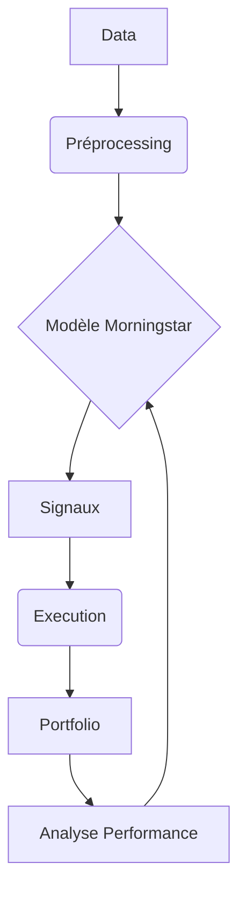

# Guide d'Utilisation - Morningstar Trading System

## 1. Configuration Initiale
### Prérequis
- Python 3.8+
- Conda/Miniconda
- Jupyter Notebook

### Installation
```bash
conda create -n trading_env python=3.8
conda activate trading_env
pip install -e .
```

## 2. Workflow Complet

### Entraînement du Modèle
1. Modifier les paramètres dans `Morningstar/configs/morningstar_config.py`
2. Exécuter le notebook d'entraînement :
```bash
jupyter notebook Morningstar/notebooks/Morningstar_Training.ipynb
```

### Backtest
1. Charger les données historiques dans `data/`
2. Lancer le notebook de backtest :
```bash
jupyter notebook Morningstar/notebooks/Morningstar_Backtest.ipynb
```

### Trading Live
```bash
python Morningstar/scripts/run_morningstar.py --trade
```

## 3. Gestion du Capital
Le système ajuste dynamiquement :
- La taille des positions selon la performance
- Le niveau de risque en fonction du drawdown
- La stratégie selon le timeframe

## 4. Monitoring
Consulter les logs :
- `logs/error.log` : Erreurs techniques
- `logs/trading.log` : Activité de trading

## 5. Architecture Technique


## 6. Personnalisation
Modifier :
- `morningstar_config.py` : Paramètres trading
- `morningstar_model.py` : Architecture du modèle
- `trading_workflow.py` : Stratégie d'exécution
