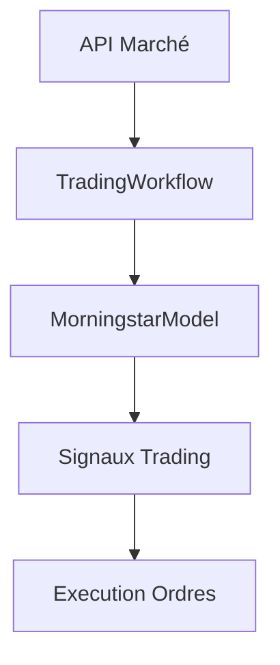

# Morningstar V2 - Robot de Trading Crypto Hybride Avancé

## Intégration du Modèle dans le Workflow

### Architecture du Workflow



### Configuration Requise

1. **Fichier config.yaml**:
```yaml
model:
  weights_path: "model/morningstar_weights.h5"
  num_technical_features: 38
  llm_embedding_dim: 768

api:
  base_url: "https://api.trading.example.com/v1"
  timeout: 10
```

2. **Structure des Données**:
- Données techniques: shape [batch_size, 38]
- Embeddings LLM: shape [batch_size, 768]

### Exécution du Workflow

```bash
python workflows/trading_workflow.py --config config/config.yaml
```

### Tests d'Intégration

1. **Tests unitaires**:
```bash
pytest tests/test_workflow.py
```

2. **Test end-to-end**:
```bash
pytest tests/validation/test_end_to_end_pipeline.py
```

## Documentation Complémentaire

- [Workflow de Trading](workflows/trading_workflow.md)
- [Interface du Modèle](model/architecture/morningstar_model.md)
- [Tests d'Intégration](tests/test_workflow.py)

## Fonctionnalités Clés

- Intégration transparente du modèle hybride
- Gestion des erreurs et mode dégradé
- Journalisation complète des opérations
- Tests automatisés de bout en bout

## Instructions d'Installation

1. Créer l'environnement conda:
```bash
conda create --name trading-env python=3.9
conda activate trading-env
```

2. Installer les dépendances:
```bash
pip install -r requirements.txt
```

3. Configurer les fichiers:
- `config/config.yaml`
- `config/secrets.env` (à partir de secrets.env.example)
