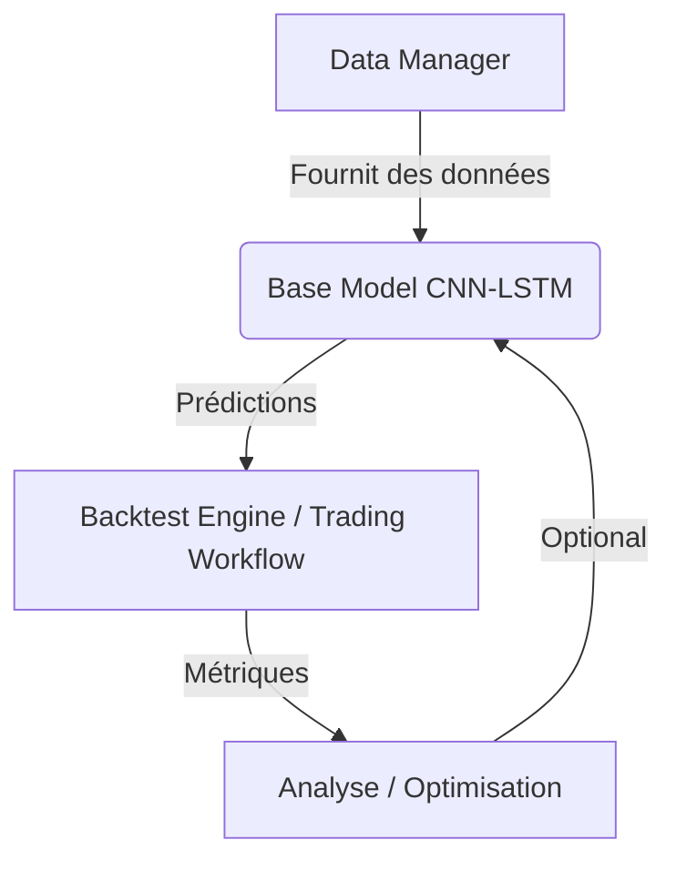

# Morningstar Trading System

## Architecture


## Fonctionnalités
- Chargement de données optimisé pour TensorFlow
- Modèle CNN-LSTM intégré
- Workflow d'entraînement complet
- Backtesting intégré
- Déploiement automatisé

## Utilisation
```bash
# Installation
conda env create -f environment.yml
conda activate trading_env

# Entraînement
python -m Morningstar.workflows.training_workflow

# Déploiement
bash scripts/deploy.sh

# Tests
pytest tests/ -v
```

## Structure des Fichiers
```
Morningstar/
├── configs/          # Configurations
├── data/             # Données brutes
├── model/            # Modèles de ML
├── tests/            # Tests unitaires et d'intégration
├── utils/            # Utilitaires
└── workflows/        # Workflows principaux
```

## Exemple d'Utilisation
```python
from Morningstar.workflows import TrainingWorkflow

workflow = TrainingWorkflow(pair="ETH/USDT", timeframe="4h")
history = workflow.run(epochs=50)
```

## Requirements (extrait de requirements.txt)
- Python 3.10+ (implicite par les dépendances)
- ccxt==4.1.91
- pandas==2.1.4
- numpy~=1.23.2 
- tensorflow==2.12.0
- pandas-ta==0.3.14b0
- tweepy==4.14.0
- asyncpraw==7.7.0
- textblob==0.17.1
- pytest==7.3.1
- pyarrow==14.0.1
- (Voir `requirements.txt` pour la liste complète)
