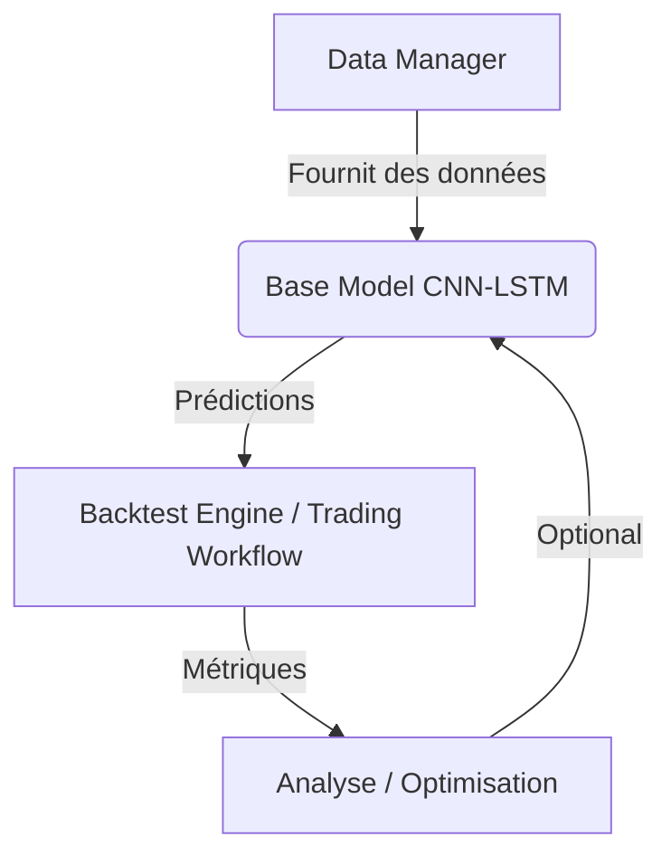

# Morningstar Trading System

## Architecture


## Fonctionnalités
- Chargement de données optimisé pour TensorFlow
- Modèle CNN-LSTM intégré
- Workflow d'entraînement complet
- Backtesting intégré
- Déploiement automatisé

## Utilisation
```bash
# Installation
conda env create -f environment.yml
conda activate trading_env

# Entraînement
python -m Morningstar.workflows.training_workflow

# Déploiement
bash scripts/deploy.sh

# Tests
pytest tests/ -v
```

## Déploiement sur Hugging Face

Le projet peut être facilement partagé et versionné sur [Hugging Face Hub](https://huggingface.co/).

1.  **Installation (si nécessaire) :**
    ```bash
    pip install huggingface_hub
    ```
2.  **Connexion :** Authentifiez-vous auprès du Hub. Vous aurez besoin d'un token d'accès (avec permissions d'écriture) généré depuis [vos paramètres Hugging Face](https://huggingface.co/settings/tokens).
    ```bash
    huggingface-cli login
    ```
3.  **Création du dépôt :** Créez un nouveau dépôt sur le Hub (via l'interface web ou par programmation).
4.  **Upload du projet :** Poussez le contenu de votre projet local vers le dépôt distant (adaptez `VotreUsername/VotreRepo` et les `ignore_patterns` si nécessaire).
    ```python
    # Exemple d'utilisation via Python
    from huggingface_hub import upload_folder

    upload_folder(
        repo_id="VotreUsername/VotreRepo",
        folder_path=".", # Dossier courant
        commit_message="Mise à jour du projet",
        ignore_patterns=["data/*", ".git*", "__pycache__/*", "*.egg-info/*", "logs/*"]
    )
    ```

## Entraînement sur Google Colab

Un notebook est fourni pour faciliter l'entraînement sur Google Colab, profitant ainsi des GPU gratuits.

1.  **Prérequis :**
    *   Téléchargez votre fichier de données d'entraînement sur votre Google Drive.
    *   Placez-le dans un dossier (par exemple `Colab Data`) et nommez-le `morningstar_data.parquet`. Le chemin attendu par défaut est `/content/drive/MyDrive/Colab Data/morningstar_data.parquet`.
2.  **Ouvrir le Notebook :** Ouvrez `notebooks/training_on_colab.ipynb` dans Google Colab.
3.  **Exécuter les cellules :** Suivez les étapes dans le notebook pour :
    *   Installer les dépendances.
    *   Cloner le dépôt (depuis GitHub ou Hugging Face).
    *   Monter Google Drive.
    *   Lancer l'entraînement.
    *   Sauvegarder le modèle entraîné (`morningstar_model.h5`) sur votre Google Drive.

## Structure des Fichiers
```
Morningstar/
├── configs/          # Configurations
├── data/             # Données brutes
├── model/            # Modèles de ML
├── tests/            # Tests unitaires et d'intégration
├── utils/            # Utilitaires
└── workflows/        # Workflows principaux
```

## Exemple d'Utilisation
```python
from Morningstar.workflows import TrainingWorkflow

workflow = TrainingWorkflow(pair="ETH/USDT", timeframe="4h")
history = workflow.run(epochs=50)
```

## Requirements (extrait de requirements.txt)
- Python 3.10+ (implicite par les dépendances)
- ccxt==4.1.91
- pandas==2.1.4
- numpy~=1.23.2 
- tensorflow==2.12.0
- pandas-ta==0.3.14b0
- tweepy==4.14.0
- asyncpraw==7.7.0
- textblob==0.17.1
- pytest==7.3.1
- pyarrow==14.0.1
- (Voir `requirements.txt` pour la liste complète)
