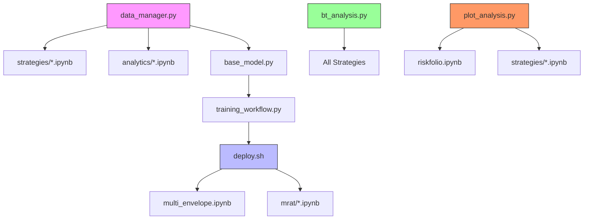
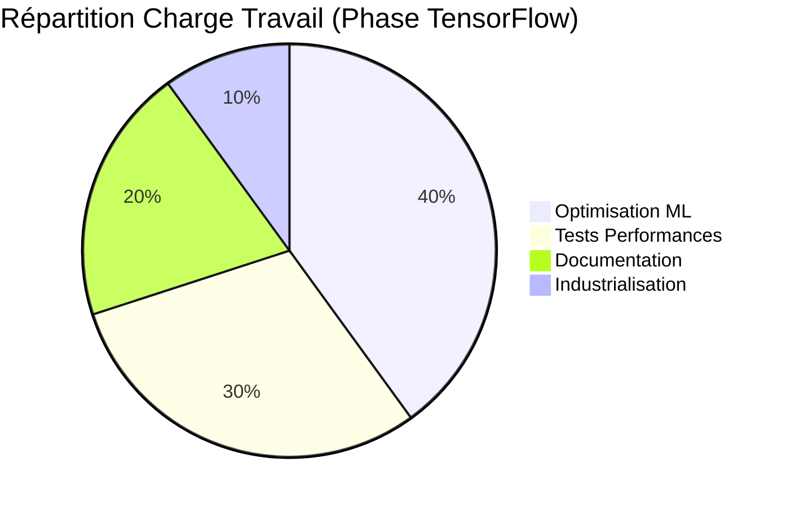

# Checklist d'Implémentation - Priorités

## 🚀 Phase 1 - Core System (M1-M3)

### ✅ Data Pipeline
- [x] Intégration API exchanges (Binance, Bitget) (via data_manager.py)
- [x] Scraper réseaux sociaux (Twitter/Reddit) (via social_scraper.py, analyse sentiment basique)
- [ ] Collecte données on-chain (Glassnode)
- [ ] Système de normalisation unifié

### 🤖 Modèle Principal
- [x] Architecture GA (sélection features) (base_model.py)
- [x] Module CNN (extraction patterns) (base_model.py)
- [x] Couche LSTM (mémoire temporelle) (base_model.py)
- [x] Mécanisme décisionnel (via trading_workflow.py, basique)

### 🧪 Backtesting
- [x] Intégration historique 10k candles (tests unitaires)
- [ ] Calcul métriques (Sharpe, Drawdown) (via bt_analysis.py)
- [ ] Comparaison stratégies existantes

## ⚡ Phase 2 - Optimisation (M4-M6)

### 🏎️ Temps Réel
- [ ] Pipeline <500ms
- [ ] Détection anomalies
- [ ] Gestion des gaps

### 🔧 Fine-Tuning
- [ ] Mécanisme online learning
- [ ] A/B testing automatique
- [ ] Versioning des modèles

### 📊 Monitoring
- [ ] Dashboard performance
- [ ] Alertes dérive modèle
- [ ] Logging des décisions

## 🌐 Phase 3 - Expansion (M7+)

### 🔀 Multi-Actifs
- [ ] Gestion corrélations
- [ ] Allocation dynamique
- [ ] Analyse cross-marché

### 🤖 AutoML
- [ ] Optimisation hyperparamètres
- [ ] Sélection automatique features
- [ ] Adaptation dynamique

### 🏦 Gestion Portefeuille
- [ ] Optimisation position sizing
- [ ] Gestion risque portfolio
- [ ] Rééquilibrage automatique

## 🔍 Analyse des Dépendances

### Prérequis Phase 1 :
1. Data Pipeline → Modèle Principal
2. Backtesting → Data Pipeline
3. Intégration API → Normalisation

### Prérequis Phase 2 :
1. Pipeline temps réel → Data Pipeline Phase 1
2. Fine-tuning → Modèle Principal Phase 1
3. Dashboard → Backtesting Phase 1

### Prérequis Phase 3 :
1. Multi-actifs → Pipeline temps réel
2. AutoML → Fine-tuning
3. Gestion portefeuille → Multi-actifs

## ✅ Déjà Réalisé

### Intégration TensorFlow & Workflow
- [x] Data Manager compatible TF (data_manager.py)
- [x] Modèle CNN-LSTM de base (base_model.py) 
- [x] Workflow d'entraînement (training_workflow.py)
- [x] Workflow de trading (trading_workflow.py)
- [x] Tests unitaires (tests/unit/model/, tests/unit/utils/test_tf_indicators.py)
- [x] Tests d'intégration (tests/integration/test_trading_workflow.py)
- [x] Script de déploiement (scripts/deploy.sh)

### Core System
- [x] Architecture globale validée (`project_documentation.md`)
- [x] Documentation complète (`project_documentation.md`)
- [x] Structure de dossiers (`/Morningstar`)

### Data Pipeline
- [x] Gestion données historiques (`utils/data_manager.py`)  
  → Utilisé par: `strategies/*.ipynb`, `analytics/*.ipynb`
- [x] Fonctions analyse technique (`utils/custom_indicators.py` - inclut TF)
  → Utilisé par: `strategies/envelopes/multi_envelope.ipynb`, `strategies/mrat/*.ipynb`, `workflows/trading_workflow.py`

### Backtesting
- [x] Méthodes backtest de base (`utils/bt_analysis.py`)
  → Utilisé par: Tous les notebooks de stratégies
- [x] Visualisations (`utils/plot_analysis.py`)
  → Utilisé par: `strategies/*.ipynb`, `analytics/riskfolio.ipynb`

### Stratégies Implémentées
- [x] MRAT (`strategies/mrat/long_short_mrat.ipynb`)
  → Utilise: `custom_indicators.py`, `bt_analysis.py`
- [x] Enveloppes (`strategies/envelopes/multi_envelope.ipynb`)  
  → Utilise: `data_manager.py`, `plot_analysis.py`
- [x] TRIX (`strategies/trix/multi_param_tf_trix.ipynb`)
  → Utilise: `custom_indicators.py`, `bt_analysis.py`

### Analytics
- [x] Copy-trading (`analytics/copy-trading.ipynb`)
  → Utilise: `data_manager.py`
- [x] Riskfolio (`analytics/riskfolio.ipynb`)
  → Utilise: `plot_analysis.py`, `bt_analysis.py`

## ⚠️ Points de Vigilance
1. Latence API Twitter/Reddit
2. Synchronisation données on-chain  
3. Calcul risque portfolio en temps réel
4. Gestion des erreurs API exchanges
5. Performance indicateurs complexes
6. Cohérence timestamps multi-sources
7. Mise à jour embeddings NLP
8. Détection changements de tendance
9. Gestion des forks blockchain
10. Qualité données sentiment

## 🔄 Fonctions à Moderniser
1. Optimisation calculs indicateurs
2. Refactoring data_manager.py
3. Unification stratégies backtest  
4. Amélioration visualisations
5. Gestion mémoire longues séries

## 📊 Graphe des Dépendances

### Légende des Couleurs :
- ■ Rose : Composants Data (Critiques)
- ■ Bleu : Analyse Technique 
- ■ Vert : Backtesting Core
- ■ Orange : Visualisation

### Recommandations d'Architecture :
1. **Éviter les dépendances circulaires** :
   - data_manager → custom_indicators → data_manager
   - Préférer des interfaces unidirectionnelles

2. **Points de Refactoring Prioritaires** :
   - Isoler les calculs lourds dans `custom_indicators.py`
   - Centraliser les appels API dans `data_manager.py`
   - Unifier l'interface des stratégies

3. **Bonnes Pratiques** :
   - Tests unitaires pour les composants centraux
   - Documentation des interfaces clés
   - Monitoring des temps d'exécution
   - Revue de code hebdomadaire

### Plan d'Action Immédiat :
1. **Semaine 1 - Audit & Benchmark**:
   - Profiling du pipeline TensorFlow
   - Mesure latence Data Manager
   - Benchmark modèle CNN-LSTM (CPU/GPU)

2. **Semaine 2 - Optimisation**:
   - Intégration TensorBoard
   - Ajout de callbacks (EarlyStopping, ModelCheckpoint)
   - Documentation spécifique ML

3. **Semaine 3 - Industrialisation**:
   - Tests de charge avec données réelles
   - Intégration distributed training
   - Revue complète architecture

