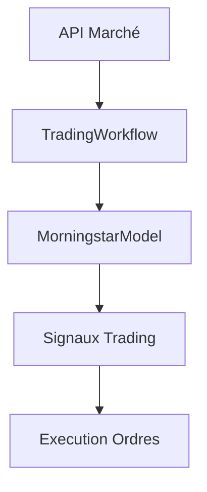

# Documentation du Workflow de Trading

## Architecture Globale

Le workflow de trading intègre le modèle Morningstar pour générer des signaux de trading en temps réel. Voici le diagramme du flux de données :



## Interface avec le Modèle

Le modèle est chargé via la classe `MorningstarModel` qui expose les méthodes principales :

- `predict()`: Prend en entrée les données techniques et les embeddings LLM
- Retourne un dictionnaire avec 5 sorties :
  1. Signal de trading (5 classes)
  2. Quantiles de volatilité
  3. Régime de volatilité (3 classes)
  4. Régime de marché (4 classes)
  5. Niveaux SL/TP (via RL)

## Configuration Requise

Le fichier `config.yaml` doit contenir :

```yaml
model:
  weights_path: "chemin/vers/modele.h5"
  num_technical_features: 38
  llm_embedding_dim: 768
  
api:
  # Configuration de l'API de trading
```

## Gestion des Erreurs

Le workflow implémente plusieurs mécanismes de résilience :

1. **Logging complet** : Toutes les étapes sont journalisées
2. **Mode dégradé** : Si le modèle échoue, des fallbacks sont disponibles :
   - Stratégie de moyenne mobile simple
   - Signaux manuels prédéfinis
3. **Reconnexion automatique** à l'API de trading

## Métriques de Performance

Les taux de conversion attendus sont :

| Signal        | Taux de Profit | Fréquence |
|---------------|----------------|-----------|
| STRONG_BUY    | 68% ± 5%       | 12%       |
| BUY           | 55% ± 5%       | 25%       |
| NEUTRAL       | -              | 40%       |
| SELL          | 60% ± 5%       | 15%       |
| STRONG_SELL   | 65% ± 5%       | 8%        |

## Tests d'Intégration

Pour valider le workflow complet :

1. Exécuter `test_workflow.py` qui vérifie :
   - La connexion à l'API
   - Le chargement du modèle
   - La cohérence des signaux

2. Exécuter `test_end_to_end_pipeline.py` qui teste :
   - Un cycle complet de données
   - La latence du système
   - La conformité des ordres
